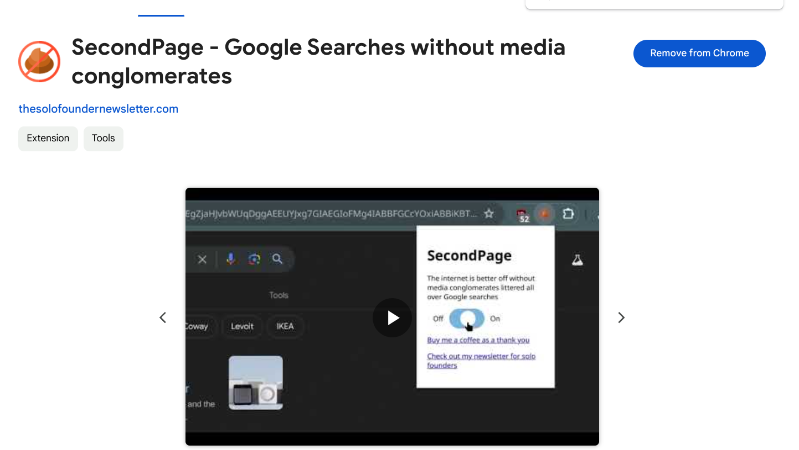

## SecondPage - Google Searches without media conglomerates

This extension blocks most of the top 1000 English sites getting Google's organic traffic. 

I impulsively created this extension with the help of Claude Opus in a day after reading this [article](https://housefresh.com/david-vs-digital-goliaths/), so HouseFresh, this is for you guys.

The problem, as discovered in a very recent [Google algo leak](https://sparktoro.com/blog/an-anonymous-source-shared-thousands-of-leaked-google-search-api-documents-with-me-everyone-in-seo-should-see-them/), is that popular media brands rank very well on Google, even if their content is utter garbage. 

[This article](https://detailed.com/google-control/) details how 16 media companies with almost 600 sites are dominating the world's Google Search results. It gives me a very funny idea, which is, if I can't stop them from dominating top search results, I can just block them out of my sight. 

I did a full write up on [my website here](https://thesolofoundernewsletter.com/p/secondpage?utm_source=referral&utm_medium=github_secondpage) if you're interested at reading more.

Usage: 
- [Install link is here](https://chromewebstore.google.com/detail/secondpage-google-searche/koaojhnbfmmjnagblonbfilccbagjpgm). The extension is enabled by default, but wait for it, there's a button to disable it if you want!
- If you'd prefer to modify the list of blocked domains, clone this repository, edit the txt file, and then go to `chrome://extensions/` -> Load unpacked -> Choose the repo's folder

I'm a developer-adjacent guy (Read: I know a bit of code and use AI tools to help me make small funny things), so this right here is probably all it is. There's not gonna be updates or anything. 

I hope to bring more awareness to this problem with Google, and this extension is my way of doing something about it. Maybe it will make the internet we're using just a little bit better.

It is licensed with an MIT License, so do whatever your heart desires with it :\).

[Buy me a coffee](https://www.buymeacoffee.com/peternguyen)

Check out my [newsletter for solo founders](https://thesolofoundernewsletter.com/?utm_source=secondpage_github) if you're interested :\) 